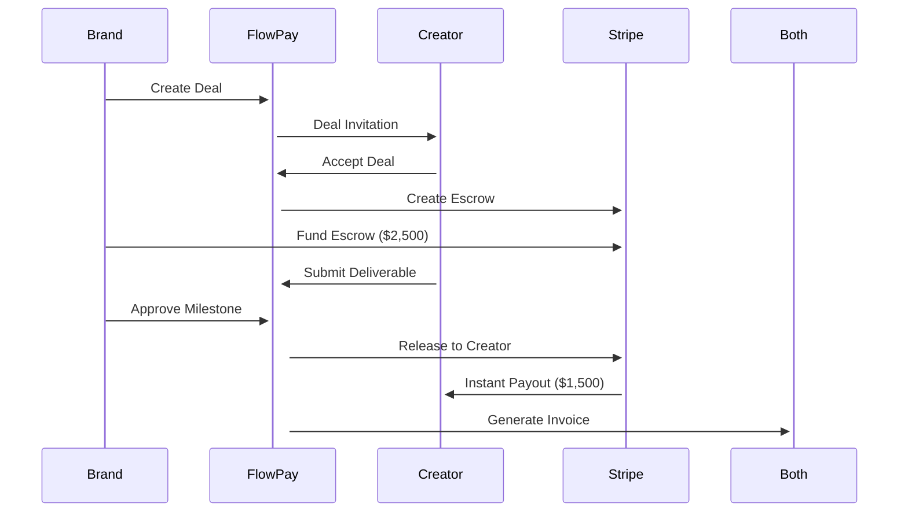

# FlowPay - Instant Creator Payment Platform

FlowPay is a mobile-first escrow platform where brands fund creator deals upfront, and funds auto-release upon deliverable approval. Built with existing payment rails (Stripe Connect) and designed with a pluggable Payments Abstraction Layer for future crypto support.

## 🏗️ Architecture

### Dual Architecture Setup
FlowPay supports two deployment architectures:

1. **🌟 Lovable Environment** - Web preview with Supabase backend
2. **🚀 Production Setup** - React Native mobile + Node.js backend

```
├── src/                 # React web app (Lovable compatible)
├── app-mobile/          # React Native (Expo) mobile app  
├── backend/             # Node.js + TypeScript + Fastify API server
├── supabase/            # Supabase functions & database
├── infra/               # Infrastructure as code
└── README.md            # This file
```

## 🌟 Quick Start (Lovable Environment)

The easiest way to get started is through the Lovable environment which provides:
- **Instant Preview** - No local setup required
- **Supabase Backend** - Fully managed database and edge functions
- **Real Stripe Integration** - Test payments with live webhooks
- **Web Interface** - Complete brand and creator workflows

### Demo Credentials
```
Brand: brand@example.com / password123
Creator: creator@example.com / password123
```

### Current Features
- ✅ User authentication with role-based access
- ✅ Project creation and management
- ✅ Deal creation with milestones
- ✅ Stripe payment integration
- ✅ Webhook handling for payment lifecycle
- ✅ Real-time database updates

## 🚀 Production Setup (Node.js Backend)

For production deployment with mobile app and advanced features:

### Prerequisites
- Node.js 18+
- PostgreSQL 14+
- Redis 6+
- Stripe account

### Backend Setup
```bash
cd backend
npm install
cp ../.env.example .env
# Edit .env with your credentials

npm run db:migrate
npm run db:seed
npm run dev
```

### Mobile App Setup
```bash
cd app-mobile
npm install
npm start
npm run ios     # iOS Simulator
npm run android # Android Emulator
```

## 💳 Payment Flows

### Core User Journeys

**Brand Flow:**
1. Create project and deal with milestones
2. Invite creator by email
3. Creator accepts → escrow created
4. Brand funds deal via Stripe
5. Creator submits deliverables
6. Brand approves → instant payout

**Creator Flow:**
1. Receive deal invitation
2. Review terms and accept
3. Complete deliverables per milestone
4. Upload files + submit links
5. Auto-payment on approval (or timer expiry)

### Technical Flow



## 🔧 Key Features

### Payments Abstraction Layer (PAL)
Pluggable interface supporting multiple payment providers:

```typescript
interface PaymentsProvider {
  createEscrow(dealId: string, currency: string): Promise<{ escrowId: string }>;
  fundEscrow(escrowId: string, amountCents: number, brandUserId: string): Promise<{ paymentRef: string }>;
  releaseToCreator(escrowId: string, amountCents: number, creatorUserId: string): Promise<{ payoutRef: string }>;
  refundToBrand(escrowId: string, amountCents?: number): Promise<{ refundRef: string }>;
  getStatus(escrowId: string): Promise<{ state: EscrowState }>;
}
```

**Current Implementations:**
- ✅ **Stripe Connect** - Production ready (both architectures)
- 🚧 **Crypto Provider** - USDC scaffold ready
- 🚧 **MangoPay** - European markets placeholder

### Database Schema
Unified schema works across both Supabase and PostgreSQL:

- **Users** - Creators, brands, admins with KYC status
- **Projects** - Brand campaign containers
- **Deals** - Escrow agreements with state machine
- **Milestones** - Payment releases with approval timers
- **Deliverables** - File uploads with SHA-256 hashing
- **Events** - Complete audit trail
- **Payouts** - Payment tracking across providers

## 🧪 Testing

### Lovable Environment Testing
1. Open project in Lovable
2. Sign up as brand: `testbrand@example.com`
3. Create project and deal
4. Sign up as creator: `testcreator@example.com`
5. Accept deal and submit deliverable
6. Test approval flow

### Stripe Test Cards
```
4242 4242 4242 4242  # Visa - Success
4000 0000 0000 0002  # Generic decline
4000 0000 0000 9995  # Insufficient funds
```

### Webhook Testing (Local)
```bash
# Install Stripe CLI
stripe listen --forward-to localhost:3001/webhooks/stripe

# For Supabase functions
stripe listen --forward-to your-project.supabase.co/functions/v1/stripe-webhooks
```

## 📱 Mobile Features (Production)

### Creator Mobile App
- Deal notifications and acceptance
- Camera integration for deliverable capture
- File upload with progress tracking
- Payout history and status
- Push notifications for deal updates

### Brand Mobile App
- Project creation and management
- Deal monitoring dashboard
- Deliverable review interface
- Payment and invoice management
- Creator performance analytics

## 🔒 Security & Compliance

### Data Protection
- Supabase RLS (Row Level Security)
- JWT authentication with refresh tokens
- PII encryption at database level
- Secure file uploads via presigned URLs

### Financial Compliance
- Stripe handles all KYC/AML requirements
- EU VAT reverse-charge for B2B deals
- 10-year invoice retention
- Complete audit trail via Events table
- GDPR-compliant data handling

### Rate Limiting
- Supabase: Built-in rate limiting
- Node.js backend: 100 req/15min per user
- Webhook signature verification
- Idempotency keys for payments

## 🌍 Deployment Options

### Option 1: Lovable + Supabase (Recommended for MVP)
```bash
# Already deployed! Just visit your Lovable preview URL
# Database, functions, and CDN all managed by Supabase
# Real-time updates and webhooks work out of the box
```

### Option 2: Full Production Stack
```bash
# Backend API
cd backend
docker build -t flowpay-backend .
docker run -p 3001:3001 flowpay-backend

# Mobile apps via EAS Build
cd app-mobile
eas build --platform all
eas submit --platform ios
eas submit --platform android
```

## 🛠️ Development Workflow

### Lovable Development
1. Make changes in Lovable interface
2. Changes auto-deploy to preview
3. Test with real Stripe integration
4. Supabase functions handle webhooks automatically

### Local Development
```bash
# Start all services
npm run dev           # Web app
npm run backend:dev   # API server  
npm run mobile:dev    # Mobile app

# Database operations
npm run db:migrate    # Run migrations
npm run db:seed       # Add demo data
npm run db:reset      # Reset database
```

## 🔮 Future Roadmap

### V2 Features (Next 6 months)
- **🪙 Crypto Payouts** - USDC on Base/Polygon via PAL interface
- **🤖 AI Content Validation** - Automated deliverable checking
- **📊 Analytics Dashboard** - Performance metrics and insights
- **🌍 International Markets** - Multi-currency and localization

### Crypto Integration (Ready to Build)
```typescript
// CryptoProvider already scaffolded
class CryptoProvider implements PaymentsProvider {
  // USDC escrow on Base network
  async createEscrow(dealId: string): Promise<{ escrowId: string }> {
    // TODO: Deploy smart contract escrow
  }
  
  // Automatic release with travel rule compliance
  async releaseToCreator(escrowId: string, amount: number): Promise<{ payoutRef: string }> {
    // TODO: Execute on-chain transfer with KYC checks
  }
}
```

## 📞 Support

### Environment-Specific Help

**Lovable Environment:**
- Use Lovable's built-in debugging tools
- Database visible in Supabase dashboard
- Real-time logs in browser dev tools

**Production Environment:**
- API docs: `http://localhost:3001/docs`
- Health check: `GET /health`
- Mobile debugging: React Native Flipper

### Troubleshooting

**Lovable Preview Issues:**
- Check browser console for errors
- Verify Supabase connection in Network tab
- Test auth flow with incognito window

**Stripe Integration:**
- Webhook events visible in Stripe dashboard
- Test webhooks with Stripe CLI
- Check Supabase function logs

**Database Issues:**
- Lovable: Check Supabase dashboard
- Production: Use `npm run db:studio`

---

## 🎯 MVP Status

### ✅ Completed (Both Architectures)
- User authentication and role management
- Project and deal creation workflows
- Stripe Connect escrow integration
- Real-time webhook processing
- Responsive web interface
- Database migrations and seeding

### 🚧 In Progress (Production Only)
- React Native mobile apps
- Advanced file upload with SHA-256
- Auto-approval timers with BullMQ
- PDF invoice generation
- Comprehensive test coverage

### 📋 Ready for Testing
Both architectures support the complete deal flow from creation to payout. The Lovable environment provides immediate access for testing, while the production setup offers the full mobile experience and advanced features.

**License:** MIT  
**Maintainer:** FlowPay Engineering Team  
**Version:** 1.0.0-beta